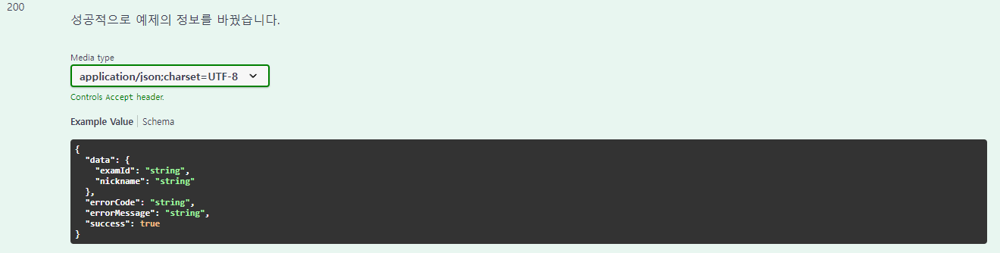
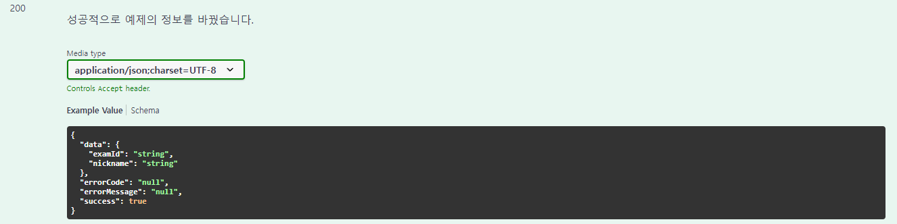
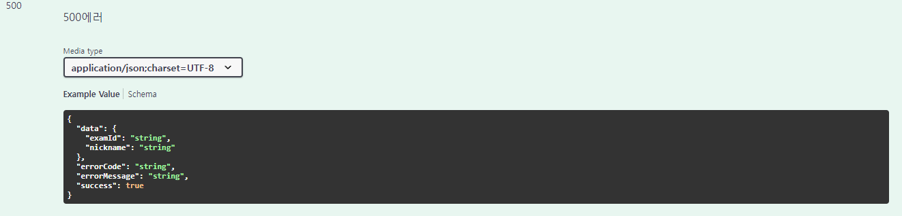
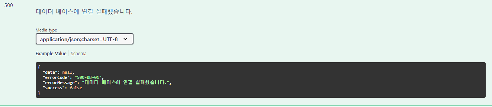
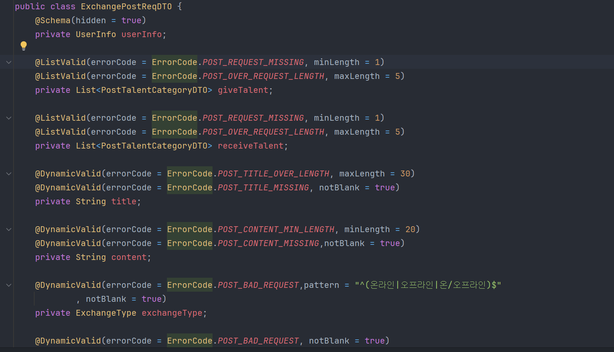
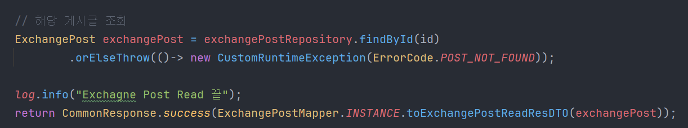
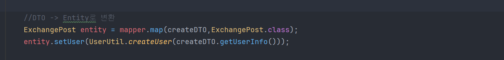
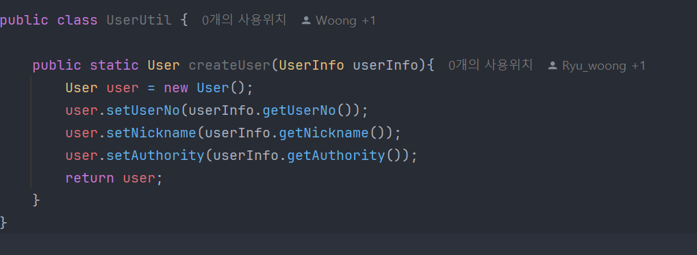
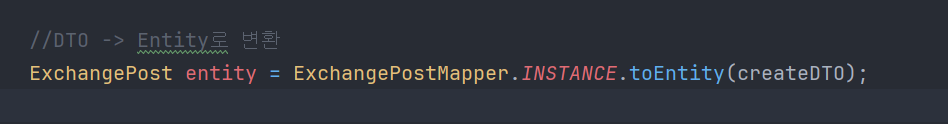
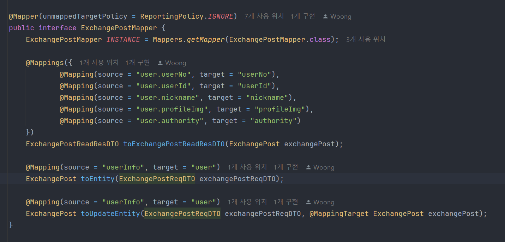

# 재능 교환 플랫폼 "Talearnt!"
인터넷 강의로 혼자 배우고, 복습하는 것 지겨우셨다구요?😥  
남을 알려주는 것보다 훌륭한 학습 방법🧐은 없다는 것을 알고 계실 거예요!  
자신이 가진 탁월한 재능을 다른 사람에게 제공하고😘, 다른 사람의 우수한 재능을 받아보세요!😍  
자신의 제자이자 스승인 대상을 만들어 재능을 교환하고 더 나은 커리어와 미래를 향해 갑니다🧲  

## Tech Stack (❁´◡`❁)
FE : React, Typescript  
BE : Java-17, Spring boot, Swagger, Spring Security, MapStruct, JPA, Query DSL  
DevOps : AWS(S3,EC2,RDS), Azure Database(Devlop전용), Docker, GtiHub Action, Gradle, Git, Jira  

```text
  BE팀이 개발할 때 중점적으로 생각한 부분은 반복적인 코드를 최소화하여 효율적인 코드 관리입니다.
  이렇게 진행한 이유는 코드를 효율적으로 관리하면, 유지보수 및 확장성이 좋아지기 떄문입니다.
    
  그래서 우리 BE팀은 이렇게 코드를 작성했습니다😁
  - 같이 일하는 동료가 내 코드를 보고 쉽게 이해할 수 있을 것 인가?
  - 일관성 있는 코드인가?
  - 의존성이 너무 심하여 확장에 문제가 있는 것은 아닌가?
```

<details>
 <summary>BE가 이러한 기술 스택을 선택한 이유📣 </summary>

  - **JAVA-17**
    - 다른 버전에 비해 오랫동안 지원함 (~2029년)
    - 빠른 발전으로 인해 다음 기술에 대한 호환성이 높을 것으로 추정
  - **Spring boot**
    - 프로젝트 생성이 편리하고, 쉽게 의존성을 추가할 수 있음
    - 다들 Spring boot 씀
  - **Swagger**
    - REST API를 우리의 코드에 맞춰 자동으로 생성하기에 코드 변경이 일어나도 빠르게 반영이 일어남
    - 프론트 엔드와 소통하는 것에 있어서 Notion보다 편리하게 관리 가능함
  - **Spring Security**
    - JWT 인증
    - 보안 관련한 기능을 비교적 쉽게 적용할 수 있음
  - **ModelMapper -> MapStruct로 변경(Updated at 2024-11-06)**
    - ModelMapper 사용 X
      - DTO Builder 패턴 사용
      - DTO <-> Entity 변환 과정 반복 코드 감소
    - MapStruct 사용 O
      - 복잡한 DTO 관계 Mapping 편의성 향상
  - **JPA**
    - 반복적인 CRUD 쿼리를 제거할 수 있음
    - 유지 보수에 좋음
  - **QueryDSL**
    - JPA로 해결이 어렵거나 불가능한 경우 혹은 코드가 너무 지저분할 정도로 분기가 많을 경우 사용
    - Java로 만들어 컴파일 단계에서 확인 가능
</details>

<details>
 <summary>DevOps 기술 스택을 선택한 이유📣 </summary>

  - **AWS (S3, EC2, RDS)**
    - 같은 클라우드 환경으로 비용 관리 편리
    - AWS 관련한 많은 자료
    - 서비스 안정성
    - S3
      - 정적인 파일 전용 ex) 이미지 파일, 문서, FE Project등
    - EC2
      - BE Project 업로드
    - RDS
      - 실제 운영 데이터 베이스
  
  - **Azure Database (개발 전용)**
    - 같은 DB 공유 시 개발 속도 향상
      - 더미 데이터
      - 테이블 구조 변경
      - 같은 환경 DB에서 개발

  - **Docker**
    - 개발 환경 및 배포 환경 일관성
    - 빠르게 배포 가능

  - **GtiHub Action**
    - CI/CD 파이프라인 자동화
    - Jenkins와 다르게 별도 서버 생성X
    - 일정 수준 이하 비용 절감 가능
    - Setting 시간 단축
    
  - **Gradle**
    - 빠른 빌드 속도
    - 쉽게 의존성 추가 및 관리 편리

  - **Git(Github)**
    - 버전 관리 편리 (이력 추적)
    - 코드 리뷰 가능
    - Jenkins 배포 파이프라인 연결 가능

  - **Jira**
    - 프로젝트 추적 관리 편리 
    - Github Commit Message로 Jira에서 코드 이슈 관리 가능
</details>


## CODE Convention 📄
코딩할 때 이것은 꼭 지켜요!  
😊중복되는 코드는 클래스 및 메소드로 분리시켜 중복을 방지해요!  
[SOLID 원칙을 지켜요](https://www.nextree.co.kr/p6960/)

<details>
  <summary>네이밍 규칙이 어렵다면 1️⃣</summary>
  
  - **Interface**
    - 명사형 또는 ~able/~ible로 끝나는 형용사형으로 이름을 지어요
    - 대문자 시작 - Pascal Case
    - 하나의 클래스만 구현할 예정이라면 인터페이스를 생성하지 않아요
    - 구현할 여러 클래스의 책임을 따져서 만들어요
  
  - **Class**
    - 명사만 가능해요
    - 대문자 시작 - Pascal Case
    - DTO일 경우 불변성을 지키기 위해 Builder 패턴을 사용해요
    - Entity는 상태 변화를 최소화하고, 필요할 경우 Lombok 등의 도구로 Getter, Setter를 자동 생성하도록 해요
    - 상속보단 합성으로 만들어요
    - 클래스가 책임이 많아지지 않도록 SRP(Single Responsibility Principle - SOLID 원칙 중 하나)를 적용해요
    - 상수 목록을 만들 경우 Enum Class로 만들어요

  - **Method**
    - 동사로 시작하고, 명확한 동작을 표현해요. ex) `addUser()`, `changeUserName()`
    - Boolean 값을 반환하는 메소드는 `is`, `has`로 시작해요
    - Camel Case
    - 하나의 메소드에는 하나의 기능만 하도록 만들어요
    - 메소드의 길이가 길어질 경우, 적절히 분리하여 재사용성을 높이고 가독성을 유지해요

  - **Variable**
    - 명사로 만들어요
    - Camel Case
    - `java.time` 패키지의 `LocalDate`, `LocalDateTime`을 사용해요
    - 상수를 정의할 때는 모두 대문자로 작성하고, 단어 간에는 언더스코어(_)로 구분해요. ex) `MAX_VALUE`, `DEFAULT_TIMEOUT`
</details>

<details>
    <summary>Entity,DTO 만드는 규칙 2️⃣</summary>

```text
Entity는 Getter,Setter를 사용합니다.
Builder 패턴을 적용시키지 않은 이유는, JPA에서는 Setter로 값이 변경되기 때문입니다.
그리고 Builder 패턴은 객체가 불변해야 하지만, 
Entity는 대부분 값이 변경되어야 하는 조건이라서 Builder 패턴과 어울리지 않습니다.

Entity를 만들 때, @Entity 어노테이션을 사용하고, Entity라는 이름은 명시하지 않습니다.
테이블 객체와 동일한 이름이면 됩니다.
예를 들어 user 테이블이 있을 경우
UserEntity 가 아닌 User면 충분합니다.

big_category 테이블이 있다고 가정한다면,
BigCategoryEntity 가 아닌 BigCategory로 만들면 됩니다.

이렇게 관리하면 아래와 같은 효과를 기대할 수 있습니다.
-직관적인 이름으로 Entity Class임을 알 수 있습니다.
-데이터베이스와 연결이 쉬워집니다.
```


```text
DTO는 데이터 불변성을 지키기 위해 Builder 패턴을 적용합니다.
@Setter는 사용하지 않습니다.

1. Request, Response DTO 구분을 짓습니다.
ex) examReqDTO,examResDTO
    
2. 두 개의 DTO 멤버 변수가 같다면 DTO로 이름을 짓습니다
ex) examDTO
    
요청은 필요하지만 응답은 필요가 없거나, 요청은 없지만 응답만 필요할 경우
1번 네이밍 규칙을 지킵니다.
ex 1) examReqDTO 만 생성
ex 2) examResDTO 만 생성

Entity <-> DTO 변환 과정은 MapStruct를 사용합니다.
변환 과정은 Service레이어에서 진행합니다.

이렇게 관리하면 아래와 같은 효과를 기대할 수 있습니다.
- 직관적인 이름으로 사용법을 쉽게 파악할 수 있습니다.
- 데이터 불변성으로 인해 데이터 신뢰성이 올라갑니다.
- 반복적인 코드를 MapStruct로 줄일 수 있습니다.
- 유지 보수를 좀 더 쉽게 할 수 있게 됩니다.
```
</details>

<details>
    <summary>Global Exception 관리 3️⃣</summary>
    
    Exception이 발생하면 개별적으로 코드를 관리하는 것보다 공통되고 일관적으로 관리할 필요성을 느꼈습니다.
    또한 일관적인 에러 메세지 및 에러 코드를 발생할 필요가 있어보입니다.
    그래서 우리는 아래와 같은 방법으로 Exception을 관리합니다.
    
    - enums.ErrorCode Enum Class에 에러 코드 및 메세지 정의
    - GlobalExceptionHandler에 CustomException 추가
    - exception.Custom Exception Class 정의
        Custom Exception을 정의할 때는 아래와 같은 방법을 사용합니다.
        - 예상할 수 없는 범위의 Exception일 경우 RuntimeException을 상속합니다.
        - 예상할 수 있는 범위의 Exception일 경우 Exception을 상속합니다.
        - 하단에 존재하는 코드를 참고하여 내부 코드를 작성합니다.
    - CommonResponseEntity를 사용하여 일관된 데이터 프레임 전송

    이렇게 관리하면 아래와 같은 효과를 기대할 수 있습니다.
    - FE와 에러 코드 공유로 ErrorCode에 대한 질문을 방지할 수 있습니다.
    - 코드 재사용성이 증가합니다.
    - 일관된 에러코드 및 메세지 전송 가능합니다.
    - 한 곳에서 Exception을 관리하기 때문에 유지 보수가 뛰어납니다.
    - throws를 이용하여 편리하게 Exception을 발생시킬 수 있습니다.

```java
/*
 * 내부 코드
 * RuntimeException, Exception 모두 내부 코드는 동일합니다.
 * */
import com.talearnt.enums.common.ErrorCode;

public class ExceptionName extends RuntimeException{
    private final ErrorCode errorCode;

    public ExceptionName(String msg){
        super(msg);
        this.errorCode = ErrorCode.해당하는Error;
    }

    public ExceptionName(String msg,Throwable cause){
        super(msg,cause);
        this.errorCode = ErrorCode.해당하는Error;
    }

    public ErrorCode getErrorCode(){
        return errorCode;
    }

}
```
</details>
<details>
    <summary>Common Response Entity 사용 4️⃣</summary>

    FE와 원활한 API 문서를 공유하기 위해 Common Response Entity를 사용하기로 했습니다.
    성공 시에는 CommonResponse.ok(T Data) 메소드 호출로 성공적인 Data 전송을 완료합니다.
    실패 시에는 CommonResponse.error(ErrorCode.에러상수값)으로 에러 코드와 메세지를 전송합니다.
    실패 시 주로 GlobalExceptionHandler에서 사용합니다.    

    이렇게 하면 아래와 같은 효과를 기대할 수 있습니다.
    - Exception 발생 시에도 일관된 프레임을 받을 수 있습니다.
    - 데이터 전송 성공, 실패 여부를 명확히 알 수 있습니다.
    - Error-Code, Error-Message로 인해 고객 응대에 대한 질을 높일 수 있습니다.
</details>


<details>
    <summary>Swagger 사용법 5️⃣</summary>

    Class 위에 @Tag 어노테이션을 사용합니다.
    Tag 어노테이션 안에 들어갈 내용은 아래와 같습니다.
- **Tag** 
  - name = "Controller 이름을 적어주세요. 단, Controller는 붙이지 않습니다." 
    - ex) ExamController -> Exam
  - description = "어떤 Controller인지 간단하게 설명해줍니다." 
    - ex) "예제 페이지 관련"

    
    Method 위에 @Operation 어노테이션을 사용합니다.
    Operation 어노테이션 안에 들어갈 내용은 아래와 같습니다.
- **Operation**
  - summary = "해당 메소드에 대한 요약입니다."
    - ex 1) 예제 추가
    - ex 2) 예제 수정
  - description = "예제를 상세히 설명해주는 공간입니다."
    - ex 1) 예제를 추가, 요청 데이터는 JWT 토큰을 사용하기에 없습니다.
    - ex 2) 예제를 수정, 예제에 대한 번호를 요청합니다.
  - responses = {성공 했을 시 보여줄 @ApiResponse를 추가합니다}
    - ex) @ApiResponse(responseCode = "200", description = "성공적으로 예제를 추가했습니다.")

개선 전 - ErrorCode 및 ErrorMessage가 String으로 마치 값이  것처럼 보인다.
    
개선 후 - null 형태란 것을 명시적으로 알려주어 FE팀이 어떻게 받을 지 알 수 있다.


    에러 코드는 ErrorCode 부분과 ErrorMessage 부분에 무엇이 들어가는지 명시적으로 알려줘야 합니다.
    단순 데이터 타입과 Status Code 만으로 명확하게 어떤 오류가 났는지 확인 할 수 없기 때문입니다.
    그러나 스키마를 통해서 예제를 각 에러마다 예제를 만들어 보여주는 것은 너무나도 많은 공간을 차지해 오히려 개발에 불편함을 얻었습니다.
    그래서 우리는 동적으로 ErrorCode에 있는 상수값들을 만들고 참조하여 예제를 만들어 보여줬습니다.
    사용 방법은 아래와 같습니다.
- **Error-ApiResponse**
  - enums.ErrorCode 에 에러 정의
  - @ApiResponse(responseCode = "404", ref = "USER_NOT_FOUND")


    아래는 완성된 코드의 모습입니다.
    ps) Service Layer와 Repository는 예제에서 구현하지 않았습니다.
```java
// 모든 것이 적용된 모습
@PostMapping("/exam")
@Operation(summary = "예제 수정 요약",
        description = "예제를 수정하는 내용입니다",
        responses = {
                @ApiResponse(responseCode = "200", description = "성공적으로 예제의 정보를 바꿨습니다."),
                @ApiResponse(responseCode = "404", ref = "USER_NOT_FOUND"),
                @ApiResponse(responseCode = "400", ref = "DUPLICATE_USER")
        })
public ResponseEntity<CommonResponse<ExamResDTO>> updateExam(@RequestBody ExamReqDTO dto) {
    Exam exam = mapper.map(dto, Exam.class);
    exam.setNickname("예제 닉네임4");
    ExamResDTO resDto = mapper.map(exam, ExamResDTO.class);
    return CommonResponse.success(resDto);
}
```
    위와 같은 방법은 아래와 같은 효과를 기대할 수 있습니다.
    - 직관적인 API 명세서를 만들어 FE 분들이 이해하기 쉬워집니다.
    - @Schema를 사용하지 않았기 때문에, 많은 Error에도 Swagger 어노테이션이 차지하는 비율이 줄었습니다.
    - 정확한 에러 예시를 통해 어떤 오류가 발생할 수 있는지 알 수 있어 FE팀이 예외처리하기 쉬워집니다.
    
    아래의 사진으로 개선된 모습을 확인할 수 있습니다
개선 전 - 데이터가 넘어 오는 것처럼 보여서 에러 때에도 FE가 데이터를 받으려 준비할 수 있다.

개선 후 - 데이터가 넘어오는 것이 없음을 명확히 하고, 에러 코드 및 메세지로 분기 및 유저에게 보여줄 수 있게 되었다.

</details>

<details>
    <summary>Custom Validation6️⃣ </summary>

    @Valid 을 사용하면서 DTO에 들어오는 값에 대한 유효성 검사는 기존의 Vaild 어노테이션만으로도 충분했습니다.
    하지만, 우리는 ErrorCode를 작성하면서 Exception에 대한 내용이 모든 코드에 동일하게 적용되어야 하는 규칙이 있었습니다.
   
    이 문제를 해결하기 위하여 우리는, Custom Valid 어노테이션을 정의하고 사용하여, ErrorCode 통일화와 가독성을 챙기기로 하였습니다.
    

</details>

<details>
    <summary>JPA Optional 올바르게 사용하기</summary>

[JPA - Optional 참고 문서](https://dev-coco.tistory.com/178)

    JPA를 사용하면서 Optional<Entity> 로 받아 if(isPresent()).get() 형태는 반복적으로 나오는 코드였습니다.
    orElseThrow를 사용하여, Optional을 피하고, 명시적으로 Exception을 발생시켜 가독성을 향상 시켰습니다.

orElseThrow 사용 예제

</details>
<details>
    <summary>ModelMapper 에서 MapStruct로 변경한 이유</summary>

    변경한 이유 : 단순한 Field 1:1인 경우 ModelMapper로 손 쉽게 매핑이 가능했으나, 복잡한 구조를 가진 Builder 패턴의 DTO가 만들어지면서
    ModelMapper만으로는 복잡한 코드가 증가하고, 가독성이 떨어졌습니다.
    UserInfo에 대한 값을 User Entity에 주입하기 위하여 UserUtil이라는 Class를 별도로 만들어서 사용한 부분이 Mapper의 기능을 제대로 못한다고 느꼈습니다.
    매핑 관계를 따로 정의하는 부분을 별도로 빼서 관리하도록 변경하여 코드를 개선하였습니다.

ModelMapper 사용 했을 떄 코드

UserUtil 코드


Map Struct를 사용했을 때 코드

Map Struct 정의 Interface

</details>

## GIT Convention 📃
😊 [GIT Flow](https://inpa.tistory.com/entry/GIT-%E2%9A%A1%EF%B8%8F-github-flow-git-flow-%F0%9F%93%88-%EB%B8%8C%EB%9E%9C%EC%B9%98-%EC%A0%84%EB%9E%B5) 브랜치 전략을 따릅니다.   

<details>
  <summary>📑양식📑 및 작성 예제 1️⃣</summary>
  양식)  
  type : Subject  
    
  body :  
    
  footer :  #이슈번호  
    
  예제)  
  feat : Add 데이터 전송을 위한 Login DTO   
     
  Json 형태로 편하게 받기 위한 DTO Class 추가  
     
  Fixes : #21  
  Related to : #17, #23
  
</details>
<details>
  <summary>type에 뭘 넣을지 모르겠다면 2️⃣</summary>
  
  - **feat** : 새로운 기능 추가
  - **fix** : 버그 수정
  - **docs** : 문서 수정
  - **style** : 코드 포맷팅, 세미콜론 누락, 코드 변경이 없는 경우
  - **refactor** : 코드 리펙토링
  - **test** : 테스트 코드, 리펙토링 테스트 코드 추가
  - **chore** : 빌드 업무 수정, 패키지 매니저 수정

</details>
<details>
  <summary>Subject에 뭘 넣을지 모르겠다면 3️⃣</summary>

  - **Add** : 추가
  - **Remove** : 삭제
  - **Simplify** : 단순화
  - **Update** : 보완
  - **Implement** : 구현
  - **Prevent** : 방지
  - **Move** : 이동
  - **Rename** : 이름 변경

</details>
<details>
  <summary>footer에 뭘 넣을지 모르겠다면 4️⃣</summary>

  - **Fixes**: 이슈 수정 중 (아직 해결되지 않은 경우)
  - **Resolves**: 이슈를 해결했을 때 사용
  - **Ref**: 참고할 이슈가 있을 때 사용
  - **Related to**: 해당 커밋에 관련된 이슈 번호 (아직 해결되지 않은 경우)

</details>


